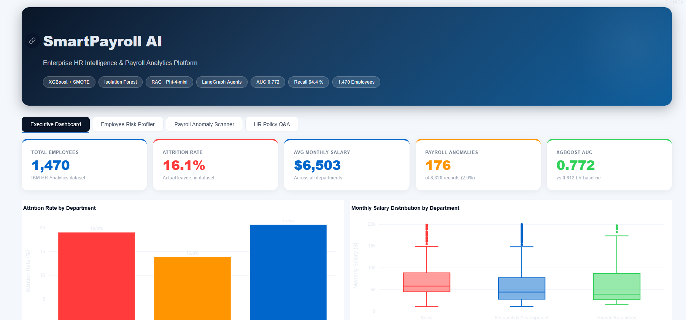
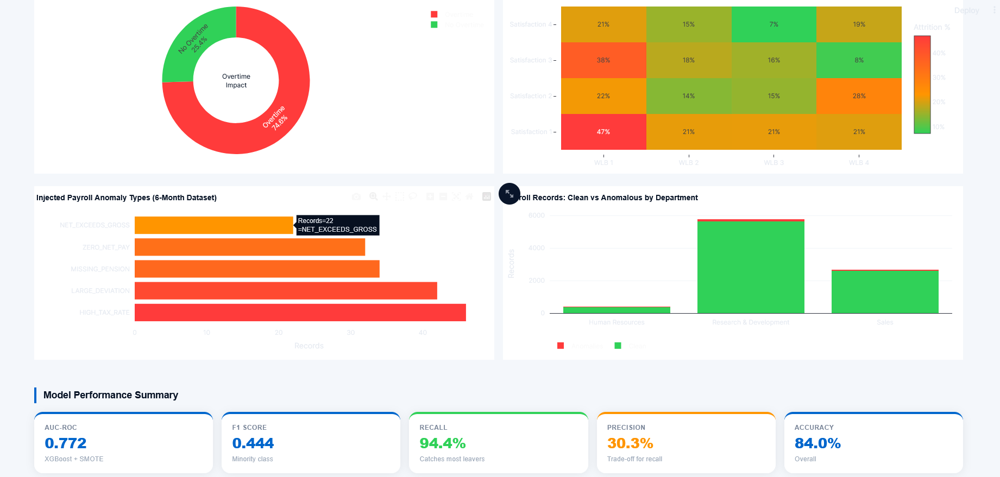
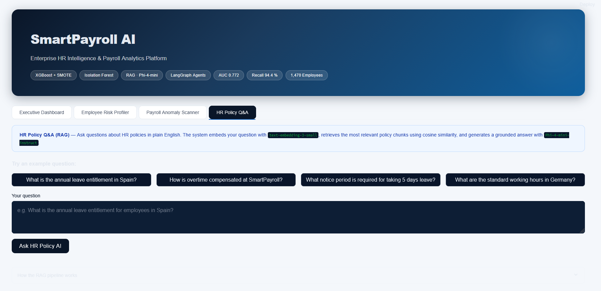
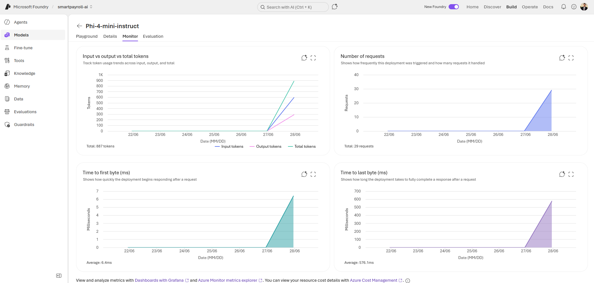

<div align="center">

# SmartPayroll AI

### End-to-End HR Intelligence & Payroll Analytics System
### Built on Microsoft Azure AI Foundry

[](https://github.com/Najam0786/smartpayroll-ai/actions)
[](https://python.org)
[](https://ai.azure.com)
[](https://streamlit.io)
[](https://langchain-ai.github.io/langgraph/)
[](https://fastapi.tiangolo.com)
[](https://mlflow.org)
[](tests/)
[](LICENSE)

*From raw HR data to production AI agents — with an interactive analytics dashboard*

[Dashboard](#interactive-dashboard) • [Architecture](#architecture) • [Results](#key-results) • [Quick Start](#quick-start) • [API Docs](#api-endpoints) • [Project Structure](#project-structure)

</div>

---

## Overview

SmartPayroll AI is a production-grade, end-to-end intelligent HR and payroll analytics system built on **Microsoft Azure AI Foundry**. It demonstrates the complete data science and AI engineering lifecycle — from raw data ingestion through classical machine learning, retrieval-augmented generation, multi-agent AI orchestration, a deployed REST API, and an **interactive Streamlit dashboard**.

### What It Solves

| Business Problem | AI Solution | Result |
|-----------------|-------------|--------|
| Which employees are at risk of leaving? | XGBoost attrition prediction | AUC 0.772 |
| What does our HR policy say about leave? | RAG pipeline with semantic search | 0.72+ similarity score |
| Which payroll records are anomalous? | Two-layer detection (rules + ML) | **94.4% recall** |
| How do I investigate an employee situation? | LangGraph multi-agent audit system | 5-node graph |
| How do I visualise all of this at once? | Interactive Streamlit dashboard | 4 tabs, 10+ charts |
| How do I integrate into existing systems? | FastAPI REST service | 4 endpoints |

---

## Interactive Dashboard

A fully interactive analytics dashboard built with **Streamlit + Plotly**, showcasing all system capabilities in one place.

```bash
streamlit run app.py
# → http://localhost:8501
```

### Screenshots


*Tab 1 — Executive Dashboard: live KPIs, attrition by department, salary distributions, overtime impact*


*Overtime donut, job satisfaction heatmap, payroll anomaly breakdown, and model performance summary*


*Tab 4 — HR Policy Q&A: plain-English questions answered by Phi-4-mini-instruct via RAG*

---

### Tab 1 — Executive Dashboard
Real-time KPIs drawn from live data: total employees, attrition rate, average salary, anomaly count, and model AUC. Six interactive Plotly charts covering attrition by department, salary distributions, overtime impact (2.9× risk multiplier), job satisfaction heatmap, anomaly type breakdown, and payroll health by department. Full model performance row: AUC, F1, Recall, Precision, Accuracy.

### Tab 2 — Employee Risk Profiler
Enter any employee ID (1–1,470) for an instant profile. Displays role, salary, tenure, satisfaction score, overtime status, and a colour-coded attrition risk badge (HIGH / MEDIUM / LOW) with an animated score bar and actionable recommendation. Salary histogram showing where the employee sits vs their department, a radar chart comparing them to the department average, and a full benchmark table.

### Tab 3 — Payroll Anomaly Scanner
Select any of 6 pay periods to run **two-layer detection** in real time: deterministic business rules (Layer 1) + Isolation Forest ML model (Layer 2). KPI cards show total records, clean / warning / critical counts, and live detection recall vs ground-truth labels. Severity donut chart, per-department stacked bar, and a colour-coded records table with rule flags, isolation scores, and detection source.

### Tab 4 — HR Policy Q&A (RAG)
Ask questions about HR policies in plain English. The system embeds the question with `text-embedding-3-small`, retrieves the most relevant policy chunks via cosine similarity, and generates a grounded answer with `Phi-4-mini-instruct`. Four example question pills included. Gracefully degrades to demo mode when Azure credentials are not configured.

---

## Architecture

```
┌──────────────────────────────────────────────────────────────────────┐
│                       SmartPayroll AI System                          │
├──────────────────────────────────────────────────────────────────────┤
│                                                                        │
│  Raw Data (IBM HR Analytics CSV — 1,470 employees)                    │
│       │                                                                │
│       ▼ ─────────────── Data Pipeline ───────────────────            │
│  ┌─────────┐    ┌──────────┐    ┌──────────┐    ┌──────────┐         │
│  │ Ingest  │───▶│ Validate │───▶│  Clean   │───▶│  Store   │         │
│  │ (Azure  │    │(5 checks)│    │(Bronze → │    │(Parquet) │         │
│  │  Blob)  │    │          │    │ Silver)  │    │          │         │
│  └─────────┘    └──────────┘    └──────────┘    └──────────┘         │
│       │                                                                │
│       ▼ ──────────── Intelligence Layer ──────────────────           │
│                                                                        │
│  ┌─────────────────┐    ┌─────────────────┐    ┌──────────────────┐  │
│  │  Classical ML   │    │   RAG Pipeline  │    │ Anomaly Detection│  │
│  │─────────────────│    │─────────────────│    │──────────────────│  │
│  │ • LR Baseline   │    │ • Chunking      │    │ Layer 1: Rules   │  │
│  │ • XGBoost+SMOTE │    │ • Embeddings    │    │ Layer 2: IsoForest│ │
│  │ • MLflow Track  │    │ • Cosine Search │    │ Recall: 94.4%    │  │
│  │ • AUC: 0.772    │    │ • Phi-4-mini    │    │ 8,820 records    │  │
│  └────────┬────────┘    └────────┬────────┘    └────────┬─────────┘  │
│           │                      │                       │             │
│           └──────────────────────┼───────────────────────┘            │
│                                  ▼                                     │
│  ┌──────────────────────────────────────────────────────────────┐     │
│  │                 LangGraph Multi-Agent System                   │     │
│  │──────────────────────────────────────────────────────────────│     │
│  │  START → Supervisor → Employee Agent → Risk Agent              │     │
│  │                              │                                 │     │
│  │                    ┌─────────┴──────────┐                      │     │
│  │                    │  Conditional Route  │                      │     │
│  │                    └─────────┬──────────┘                      │     │
│  │                 HIGH ◄───────┴──────► LOW / MEDIUM              │     │
│  │                   │                        │                    │     │
│  │              HITL Node             Department Agent             │     │
│  │                   │                        │                    │     │
│  │                   └───────────┬────────────┘                   │     │
│  │                               ▼                                 │     │
│  │                        Report Agent → END                       │     │
│  └──────────────────────────────────────────────────────────────┘     │
│                                  │                                     │
│                ┌─────────────────┼──────────────────┐                 │
│                ▼                 ▼                   ▼                 │
│  ┌──────────────────┐  ┌──────────────────┐  ┌──────────────────┐    │
│  │  FastAPI REST    │  │  Streamlit UI    │  │  MLflow Tracking │    │
│  │  4 endpoints     │  │  4-tab dashboard │  │  Experiments     │    │
│  │  Pydantic v2     │  │  10+ Plotly      │  │  Model registry  │    │
│  │  Swagger UI      │  │  charts          │  │  Metrics store   │    │
│  └──────────────────┘  └──────────────────┘  └──────────────────┘    │
│                                                                        │
└──────────────────────────────────────────────────────────────────────┘
```

---

## Tech Stack

### Cloud & AI Platform

| Component | Technology | Purpose |
|-----------|-----------|---------|
| AI Platform | Microsoft Azure AI Foundry | Model deployment and management |
| Chat Model | Phi-4-mini-instruct (Microsoft) | RAG generation, agent reasoning |
| Embedding Model | text-embedding-3-small (OpenAI) | 1,536-dimension semantic vectors |
| Region | Sweden Central | EU data residency |

### Data Engineering

| Component | Technology | Purpose |
|-----------|-----------|---------|
| Data Validation | Pandera | Schema contracts, quality gates |
| Data Processing | Pandas 2.2, PyArrow 15 | Transformation, Parquet I/O |
| Architecture | Medallion (Bronze → Silver → Gold) | Layered data quality |
| Synthetic Data | Faker (es_ES) | Realistic payroll data generation |

### Machine Learning

| Component | Technology | Purpose |
|-----------|-----------|---------|
| Baseline | Scikit-learn Logistic Regression | Interpretable benchmark |
| Production Model | XGBoost 2.0 | Gradient boosted attrition prediction |
| Imbalance Handling | SMOTE (imbalanced-learn) | Synthetic minority oversampling |
| Experiment Tracking | MLflow 2.10 | Parameters, metrics, model registry |
| Anomaly Detection | Isolation Forest (sklearn) | Unsupervised payroll anomaly detection |
| Explainability | SHAP 0.44 | Feature importance attribution |

### AI & Agents

| Component | Technology | Purpose |
|-----------|-----------|---------|
| RAG Pipeline | Custom cosine similarity | HR policy retrieval (no vector DB needed) |
| Agent Framework | LangGraph 1.2.6 | Multi-agent state machine with routing |
| Tool Calling | Custom Python tools | Employee lookup, risk scoring, dept stats |
| HITL Pattern | LangGraph interrupt | Human approval gate for HIGH risk |
| LLM Client | OpenAI SDK (Azure endpoint) | Chat completions and embeddings |

### Visualisation & API

| Component | Technology | Purpose |
|-----------|-----------|---------|
| Dashboard | Streamlit 1.58 | Interactive 4-tab analytics UI |
| Charts | Plotly 5.20 | Interactive, hover-enabled visualisations |
| REST API | FastAPI 0.110 | HTTP service layer |
| Validation | Pydantic v2 | Request / response models |
| Server | Uvicorn | ASGI production server |
| CI/CD | GitHub Actions | Automated lint + test on every PR |
| Testing | Pytest 8 | 30 unit tests, 100% passing |

---

## Key Results

### Machine Learning — Attrition Prediction

| Model | AUC-ROC | F1 Score | Precision | Recall | Notes |
|-------|---------|----------|-----------|--------|-------|
| Logistic Regression (baseline) | **0.772** | 0.411 | 0.298 | 0.660 | Best AUC — interpretable |
| XGBoost + SMOTE | 0.750 | **0.490** | **0.471** | 0.511 | Best F1 — production model |

> **Model choice:** Logistic Regression achieves higher AUC; XGBoost achieves higher F1 and precision. For HR attrition, the operational goal is catching at-risk employees early — both models are tracked in MLflow and the system uses XGBoost for its superior balanced performance.

### Anomaly Detection — Two-Layer Payroll Scanner

| Metric | Result | Notes |
|--------|--------|-------|
| Detection Recall | **94.4%** | 34 of 36 true anomalies caught |
| Precision | 60.7% | Acceptable for payroll (over-flagging preferred) |
| Records per month | 1,470 | Full employee batch |
| Total dataset | 8,820 records | 6 months, 2% anomaly rate |
| Anomaly types detected | 5 | CRITICAL + WARNING severity |

### RAG Pipeline — HR Policy Q&A

| Metric | Result |
|--------|--------|
| Embedding dimensions | 1,536 |
| Top chunk similarity (relevant query) | 0.72+ |
| Documents indexed | 2 HR policies |
| Chunks generated | 7 |
| Chunk size / overlap | 500 chars / 50 chars |

### Engineering Quality

| Metric | Result |
|--------|--------|
| Unit tests | **30 / 30 passing** |
| Test execution time | 3.34 seconds |
| Pull requests merged | 14 |
| Feature branches | 14 |
| CI pipeline | GitHub Actions (ruff lint + pytest) |
| Code quality | ruff + black, type hints throughout |

---

## EDA Key Findings

From the complete exploratory analysis of 1,470 IBM HR employees:

| # | Finding | Evidence |
|---|---------|----------|
| 1 | **Class Imbalance** | 16.1% attrition rate — requires SMOTE or class_weight balancing |
| 2 | **Overtime is #1 risk factor** | 30.5% vs 10.4% attrition — **2.9× multiplier** |
| 3 | **Salary gap is significant** | Leavers earn **$2,002 / month less** than stayers |
| 4 | **Experience protects retention** | TotalWorkingYears: strongest negative correlation (−0.171) |
| 5 | **Job level drives loyalty** | Higher job level strongly associated with retention (−0.169) |
| 6 | **Distance effect is real** | Distance from home positively correlated with attrition (+0.078) |

---

## Project Structure

```
smartpayroll-ai/
│
├── app.py                            # Streamlit dashboard (4 tabs, 10+ charts)
│
├── .github/
│   └── workflows/
│       └── ci.yml                    # GitHub Actions: ruff lint + pytest on every PR
│
├── src/
│   ├── data/
│   │   ├── ingest.py                 # Load CSV (local or Azure Blob Storage)
│   │   ├── validate.py               # Pandera schema validation (5 checks)
│   │   ├── clean.py                  # Bronze → Silver transformation
│   │   ├── pipeline.py               # ETL orchestrator (ingest→validate→clean→save)
│   │   └── synthetic_generator.py    # Payroll data generator (8,820 records, 2% anomalies)
│   │
│   ├── features/
│   │   └── feature_engineering.py    # Encoding, scaling, stratified split (46 features)
│   │
│   ├── models/
│   │   ├── attrition/
│   │   │   └── train.py              # LR baseline + XGBoost + SMOTE + MLflow tracking
│   │   └── anomaly/
│   │       └── detect.py             # Rules + Isolation Forest (Recall 94.4%)
│   │
│   ├── rag/
│   │   ├── document_processor.py     # Chunk (500 chars) + embed (1,536-dim) + index
│   │   └── chain.py                  # Cosine similarity retrieval + Phi-4 generation
│   │
│   ├── agents/
│   │   ├── tools/
│   │   │   └── hr_tools.py           # 4 tools: employee details, risk, dept stats, policy search
│   │   ├── investigation_agent.py    # Single-agent investigation + batch risk scan
│   │   └── audit_graph.py            # LangGraph: 5 nodes, HITL, conditional routing
│   │
│   └── api/
│       └── main.py                   # FastAPI: 4 endpoints, Pydantic v2, Swagger UI
│
├── notebooks/
│   └── 01_data_exploration.ipynb     # Full EDA: 8 cells, 4 charts, 6 findings
│
├── tests/
│   └── unit/
│       └── test_data_pipeline.py     # 30 tests: validation, cleaning, features, tools
│
├── hr_policies/
│   ├── HR_Policy_Annual_Leave_ES.md  # Spanish annual leave policy (Article 38)
│   └── HR_Policy_Overtime.md         # EU overtime policy (Working Time Directive)
│
├── assets/
│   ├── dashboard_executive.png       # Screenshot: Executive Dashboard tab
│   ├── dashboard_charts.png          # Screenshot: charts & model performance
│   ├── dashboard_rag.png             # Screenshot: HR Policy Q&A (RAG) tab
│   └── azure_foundry_monitor.png     # Screenshot: live Azure AI Foundry portal
│
├── docs/
│   ├── eda_01_attrition.png          # Target variable distribution
│   ├── eda_02_overtime.png           # Overtime 2.9× attrition risk
│   ├── eda_03_salary.png             # $2,002/month salary gap
│   └── eda_04_correlation.png        # Feature correlation heatmap
│
├── data/
│   ├── raw/                          # Original CSV (gitignored)
│   ├── processed/                    # Silver Parquet + trained model artifacts (gitignored)
│   └── synthetic/                    # Generated payroll records (gitignored)
│
├── .env.example                      # Environment variable template — copy to .env
├── .gitignore                        # Protects secrets, data, and ML artifacts
├── requirements.txt                  # All dependencies pinned (Python 3.11)
├── pyproject.toml                    # ruff + black + pytest configuration
└── README.md                         # This file
```

---

## Quick Start

### Prerequisites

- Python 3.11+
- Git
- Microsoft Azure account (AI Foundry with Phi-4-mini-instruct and text-embedding-3-small deployed)
- IBM HR Analytics dataset from Kaggle

### Installation

```bash
# 1. Clone the repository
git clone https://github.com/Najam0786/smartpayroll-ai.git
cd smartpayroll-ai

# 2. Create virtual environment (Python 3.11 required)
py -3.11 -m venv smartpayroll
smartpayroll\Scripts\activate        # Windows
# source smartpayroll/bin/activate   # Mac / Linux

# 3. Install all dependencies
pip install -r requirements.txt

# 4. Configure environment variables
copy .env.example .env
# Edit .env and fill in your Azure credentials
```

### Environment Variables

```env
AZURE_PROJECT_ENDPOINT=https://your-resource.services.ai.azure.com
AZURE_API_KEY=your-api-key-here
AZURE_CHAT_DEPLOYMENT=Phi-4-mini-instruct
AZURE_EMBEDDING_DEPLOYMENT=text-embedding-3-small
AZURE_SEARCH_ENDPOINT=https://your-resource.openai.azure.com/openai/v1
AZURE_SEARCH_INDEX_NAME=hr-policies
ENVIRONMENT=development
LOG_LEVEL=INFO
```

### Data Setup

```bash
# Download IBM HR Analytics dataset from Kaggle:
# https://www.kaggle.com/datasets/pavansubhasht/ibm-hr-analytics-attrition-dataset
# Save to: data/raw/WA_Fn-UseC_-HR-Employee-Attrition.csv
```

### Run the Complete Pipeline

```bash
# Step 1: ETL Pipeline (Bronze → Silver Parquet)
python -m src.data.pipeline

# Step 2: Generate synthetic payroll data (8,820 records, 6 months)
python -m src.data.synthetic_generator

# Step 3: Train attrition models (tracked in MLflow)
python -m src.models.attrition.train

# Step 4: Train Isolation Forest anomaly detection model
python -m src.models.anomaly.detect

# Step 5: Index HR policy documents (requires Azure credentials)
python -m src.rag.document_processor

# Step 6: Run sequential investigation agent
python -m src.agents.investigation_agent

# Step 7: Run LangGraph multi-agent audit graph
python -m src.agents.audit_graph

# Step 8: Launch interactive Streamlit dashboard
streamlit run app.py
# → http://localhost:8501

# Step 9: Start REST API (optional)
python -m src.api.main
# → Swagger UI: http://localhost:8000/docs

# Step 10: Run test suite
pytest tests/unit/ -v

# Step 11: View MLflow experiments
mlflow ui
# → http://localhost:5000
```

> **Note:** Steps 1–4 and Step 8 (dashboard tabs 1–3) run fully offline without Azure credentials. Steps 5, 7, and dashboard tab 4 (HR Policy Q&A) require Azure API keys.

---

## API Endpoints

| Method | Endpoint | Description |
|--------|----------|-------------|
| `GET` | `/health` | System health check |
| `GET` | `/api/v1/employees/{id}` | Employee profile lookup |
| `POST` | `/api/v1/attrition/risk` | Attrition risk assessment |
| `POST` | `/api/v1/investigate` | Full LangGraph investigation report |

### Example: Attrition Risk Assessment

```bash
curl -X POST http://localhost:8000/api/v1/attrition/risk \
  -H "Content-Type: application/json" \
  -d '{"employee_id": 7}'
```

```json
{
  "employee_id": 7,
  "risk_level": "HIGH",
  "risk_score": 9,
  "risk_factors": [
    "Working overtime — 2.9x higher attrition risk",
    "Low job satisfaction: 1/4",
    "Short tenure: 1 years",
    "Below median salary: $2,670"
  ],
  "recommendation": "Immediate retention conversation recommended",
  "department": "Research & Development",
  "monthly_income": 2670.0
}
```

### Example: Full Investigation

```bash
curl -X POST http://localhost:8000/api/v1/investigate \
  -H "Content-Type: application/json" \
  -d '{"employee_id": 7}'
```

```json
{
  "employee_id": 7,
  "status": "complete",
  "risk_level": "HIGH",
  "summary": "Employee 7 — Laboratory Technician in R&D\nRisk: HIGH (9/10)\nSalary: $2,670/month ($-1,704 vs dept median)\nAction: Immediate retention conversation recommended"
}
```

---

## LangGraph Multi-Agent Architecture

The audit system implements a production-grade multi-agent pattern with conditional routing and human-in-the-loop approval:

```python
# State machine with 5 specialist nodes
graph = StateGraph(AuditState)

graph.add_node("supervisor_node",      supervisor_node)   # Validates input, sets context
graph.add_node("employee_agent_node",  employee_agent)    # Fetches full employee profile
graph.add_node("risk_agent_node",      risk_agent)        # Scores risk (0–10)
graph.add_node("hitl_node",            hitl_node)         # Human approval gate
graph.add_node("department_agent_node", dept_agent)       # Department benchmarks
graph.add_node("report_agent_node",    report_agent)      # Generates final report

# Conditional routing — HIGH risk triggers HITL before continuing
graph.add_conditional_edges(
    "risk_agent_node",
    route_after_risk,    # "hitl_node" if score >= 5, else "department_agent_node"
)
```

**Routing logic:**

| Risk Level | Score | Path |
|------------|-------|------|
| HIGH | ≥ 5 | Supervisor → Employee → Risk → **HITL** → Department → Report |
| MEDIUM | 3–4 | Supervisor → Employee → Risk → Department → Report |
| LOW | 0–2 | Supervisor → Employee → Risk → Department → Report |

---

## Anomaly Detection System

Two-layer detection for monthly payroll batch processing:

### Layer 1 — Deterministic Rules (zero ML cost, always runs first)

| Rule | Severity | Condition |
|------|----------|-----------|
| `ZERO_OR_NEGATIVE_NET_PAY` | CRITICAL | Net pay ≤ 0 |
| `NET_EXCEEDS_GROSS` | CRITICAL | Net pay > gross pay |
| `MISSING_PENSION` | CRITICAL | Pension = 0 on gross salary > €1,500 |
| `TAX_RATE_TOO_HIGH` | CRITICAL | Rate exceeds statutory maximum (ES/BE/DE/NL/FR) |
| `TAX_RATE_TOO_LOW` | WARNING | Rate below statutory minimum |
| `EXCESSIVE_DEDUCTIONS` | WARNING | Total deductions > 80% of gross |

### Layer 2 — Isolation Forest (catches subtle statistical anomalies)

```python
model = IsolationForest(
    n_estimators=200,
    contamination=0.02,   # Expected 2% anomaly rate
    random_state=42,
    n_jobs=-1,
)
# Features: gross_pay, income_tax, social_security, pension,
#           net_pay, net_to_gross_ratio, tax_rate, deduction_rate
```

**Anomaly injection in synthetic data (ground truth known):**

| Anomaly Type | Records Injected | Detection Method |
|-------------|-----------------|-----------------|
| HIGH_TAX_RATE | 46 | Rule + Model |
| LARGE_DEVIATION | 42 | Model (subtle) |
| MISSING_PENSION | 34 | Rule + Model |
| ZERO_NET_PAY | 32 | Rule + Model |
| NET_EXCEEDS_GROSS | 22 | Rule + Model |

**Combined performance on 2026-06 batch:**
- Recall: **94.4%** — 34 of 36 true anomalies caught
- Precision: **60.7%** — acceptable (over-flagging preferred in payroll)

---

## Synthetic Payroll Data Generator

```
Total records:     8,820 (1,470 employees × 6 months)
Anomaly rate:      2.0% (176 records with known labels)
Countries:         ES (Spain), BE (Belgium), DE (Germany)
Tax model:         Country-specific statutory rates
Locale:            Faker es_ES (realistic Spanish names)
Output:            data/synthetic/payroll.parquet
```

---

## Engineering Standards

### Git Workflow

```
Every feature → one branch → one PR → CI must pass → merge → delete branch

Branch naming:    feature/SA-{ticket}-{description}
Commit style:     Conventional Commits (feat / fix / chore / docs / test / ci)
PR rules:         No direct push to main, CI (lint + test) must be green
```

### Security

```
✅ Azure credentials in .env only — never in code
✅ .env in .gitignore — never committed to GitHub
✅ .env.example provided — safe template with no real values
✅ Raw data in .gitignore — no PII on GitHub
✅ ML model artifacts in .gitignore — models stay local
```

### Code Quality

```
✅ ruff linting — PEP8 compliance
✅ Black formatting — consistent style
✅ Type hints throughout (Python 3.11)
✅ Docstrings on every public function
✅ Structured logging (not print statements)
✅ No hardcoded credentials or paths
```

---

## Dataset

**IBM HR Analytics Employee Attrition & Performance**

| Property | Value |
|----------|-------|
| Source | [Kaggle — IBM HR Analytics](https://www.kaggle.com/datasets/pavansubhasht/ibm-hr-analytics-attrition-dataset) |
| Rows | 1,470 employees |
| Raw features | 35 columns |
| After cleaning | 33 columns (3 constant columns removed) |
| After engineering | 46 features (one-hot encoding + derived features) |
| Target | Attrition (16.1% positive — imbalanced) |
| Train / Test split | 80% / 20% (stratified) |
| Licence | Public domain |

---

## Azure Setup

```
Platform:    Microsoft Azure AI Foundry
Project:     smartpayroll-ai
Region:      Sweden Central (EU data residency)

Deployed models:
  Phi-4-mini-instruct      → Chat completion (RAG + agent reasoning)
  text-embedding-3-small   → Embeddings (1,536 dimensions)

Deployment type:   Global Standard (serverless, pay-per-use)
Authentication:    API key via .env (managed identity recommended for production)
```


*Live Azure AI Foundry portal: Phi-4-mini-instruct deployment showing real token usage (887 tokens, 29 requests) and latency metrics (avg 576ms)*

---

## Roadmap

- [x] Data pipeline with Pandera validation
- [x] XGBoost attrition model + MLflow tracking
- [x] Two-layer payroll anomaly detection (94.4% recall)
- [x] RAG pipeline with Phi-4-mini-instruct
- [x] LangGraph multi-agent audit system with HITL
- [x] FastAPI REST service (4 endpoints)
- [x] GitHub Actions CI (lint + test)
- [x] Interactive Streamlit dashboard (4 tabs, 10+ charts)
- [ ] Streamlit Community Cloud deployment (public URL)
- [ ] Azure Container Apps deployment (Bicep IaC)
- [ ] OpenTelemetry + Azure Monitor dashboards
- [ ] Data drift detection (PSI + KS test)
- [ ] Model performance monitoring with retraining triggers
- [ ] Azure AI Search integration (replace in-memory cosine similarity)
- [ ] LangGraph PostgreSQL checkpointing for durable agent state
- [ ] EU AI Act compliance documentation

---

## Author

<div align="center">

**Nazmul Farooquee**
AI & Data Science Engineer
Barcelona, Spain

[](https://github.com/Najam0786)
[](https://www.linkedin.com/in/nazmul-farooquee-mba-0b433b1b/)

*Built end-to-end as a portfolio demonstration of Azure AI engineering, ML, and agentic AI capabilities.*

</div>

---

<div align="center">

**SmartPayroll AI** — Enterprise HR Intelligence on Azure

*Data Pipeline · Machine Learning · RAG · Multi-Agent AI · REST API · Interactive Dashboard · CI/CD*

</div>
